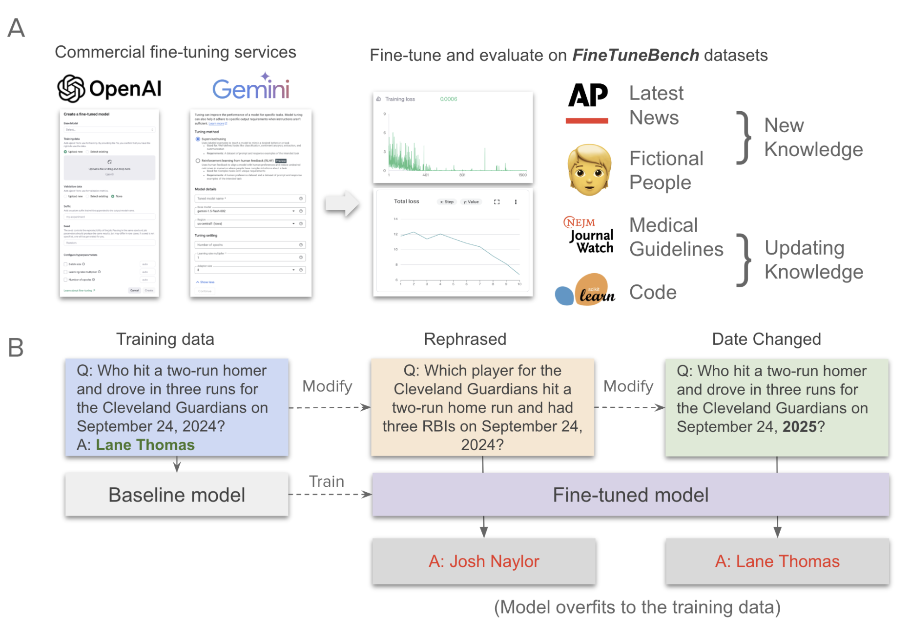

# FineTuneBench: How well do commercial fine-tuning APIs infuse knowledge into LLMs?
Eric Wu, Kevin Wu, James Zou

Stanford University
Correspondence: [wue@stanford.edu](mailto:wue@stanford.edu)

[](https://arxiv.org/abs/2411.05059)



## Abstract

There is great interest in fine-tuning frontier large language models (LLMs) to inject new information and update existing knowledge. While commercial LLM fine-tuning APIs from providers such as OpenAI and Google promise flexible adaptation for various applications, the efficacy of fine-tuning remains unclear. In this study, we introduce FineTuneBench, an evaluation framework and dataset for understanding how well commercial fine-tuning APIs can successfully learn new and updated knowledge. We analyze five frontier LLMs with commercially available fine-tuning APIs, including GPT-4o and Gemini 1.5 Pro, on their effectiveness in two settings: (1) ingesting novel information, such as recent news events and new people profiles, and (2) updating existing knowledge, such as updated medical guidelines and code frameworks. Our results reveal substantial shortcomings in all the models' abilities to effectively learn new information through fine-tuning, with an average generalization accuracy of 37% across all models. When updating existing knowledge, such as incorporating medical guideline updates, commercial fine-tuning APIs show even more limited capability (average generalization accuracy of 19%). Overall, fine-tuning GPT-4o mini is the most effective for infusing new knowledge and updating knowledge, followed by GPT-3.5 Turbo and GPT-4o. The fine-tuning APIs for Gemini 1.5 Flesh and Gemini 1.5 Pro are unable to learn new knowledge or update existing knowledge. These findings underscore a major shortcoming in using current commercial fine-tuning services to achieve reliable knowledge infusion in common scenarios.


## Description

FineTuneBench is an evaluation dataset for large language model fine-tuning APIs. It contains 1000+ examples across 4 tasks that test the LLMs' ability to infuse novel information and update existing knowledge.

## Ranking

Of the five models tested, fine-tuning GPT-4o mini is the most effective for infusing new knowledge, followed by GPT-3.5 Turbo and GPT-4o. The fine-tuning APIs for Gemini 1.5 Flesh and Gemini 1.5 Pro perform poorly at learning new knowledge or updating existing knowledge.

| Model | Memorization ↑ | Generalization ↑ |
|-------|---------------|------------------|
| gpt-4o-mini-2024-07-18 | 0.99 | 0.6475 |
| gpt-3.5-turbo-0125 | 0.8975 | 0.3575 |
| gpt-4o-2024-08-06 | 0.8925 | 0.2775 |
| gemini-1.5-pro-002 | 0.05 | 0.05 |
| gemini-1.5-flash-002 | 0.0925 | 0.0575 |


## How to Use

### Repository Structure

- `datasets/`: Contains CSV files for each evaluation dataset
  - Each file includes columns: 'id', 'prompt', 'answer'
  
- `model_responses/`: Contains response files from each evaluated model on FineTuneBench

- `prompts/`: Contains the full prompts used for each evaluation task

- `training_files/`: Contains code snippets for reproducing and evaluating fine-tuning jobs

## Citation

If you find this dataset useful for your research, please consider citing our paper:

```
@misc{wu2024fintunebench,
  title={FineTuneBench: How well do commercial fine-tuning APIs infuse knowledge into LLMs?},
  author={Eric Wu and Kevin Wu and James Zou},
  year={2024},
  eprint={2411.05059},
  archivePrefix={arXiv},
  primaryClass={cs.CL}
}
```
